# 📰 香港デイリーニュース自動生成システム

**毎日朝6時（JST）に香港のニュースを自動収集・記事生成・note.com投稿**

[](https://github.com/cantoneseslang/hongkong-daily-news-note/actions/workflows/daily-news.yml)

---

## 🎯 概要

このシステムは、香港の主要メディアからRSS経由でニュースを収集し、Grok APIで日本語記事を生成、note.comに自動投稿するフルオートメーションシステムです。

### 特徴
- ✅ **完全自動化**: GitHub Actionsで毎日定時実行
- ✅ **重複除外**: 過去3日分のニュースと比較して重複を排除
- ✅ **カテゴリー分類**: テクノロジー、ビジネス、政治など自動分類
- ✅ **天気情報統合**: 香港天文台のデータも含む
- ✅ **note.com自動投稿**: Playwrightで完全自動化

---

## 🚀 自動実行フロー

```mermaid
graph LR
    A[毎日 6:00 JST] --> B[RSS取得]
    B --> C[重複除外]
    C --> D[Grok API]
    D --> E[記事生成]
    E --> F[GitHub保存]
    F --> G[note.com投稿]
    G --> H[完了]
```



---

## 📁 主要ファイル

| ファイル | 説明 |
|---------|------|
| `.github/workflows/daily-news.yml` | GitHub Actionsワークフロー |
| `fetch_rss_news.py` | RSSニュース収集 |
| `generate_article.py` | 記事生成（Grok API） |
| `note_auto_post.js` | note.com自動投稿 |
| `daily-articles/` | 生成された記事（MD形式） |

---

## 🛠️ セットアップ

### 1. リポジトリのクローン
```bash
git clone https://github.com/cantoneseslang/hongkong-daily-news-note.git
cd hongkong-daily-news-note
```

### 2. Python環境構築
```bash
python -m venv venv
source venv/bin/activate  # Windows: venv\Scripts\activate
pip install -r requirements.txt
```

### 3. Node.js環境構築
```bash
npm install
npx playwright install chromium
```

### 4. 設定ファイル作成
```bash
cat > config.json << EOF
{
  "grok_api_key": "xai-YOUR_KEY_HERE"
}
EOF
```

### 5. GitHub Secretsの設定
GitHub リポジトリの Settings → Secrets で以下を追加：
- `GROK_API_KEY`: Grok APIキー
- `NOTE_EMAIL`: note.comメールアドレス
- `NOTE_PASSWORD`: note.comパスワード

---

## 🧪 ローカル実行

### 記事生成のみ
```bash
# 1. ニュース取得
python fetch_rss_news.py

# 2. 記事生成
python generate_article.py daily-articles/rss_news_*.json
```

### note.com投稿
```bash
node note_auto_post.js \
  daily-articles/hongkong-news_2025-10-22.md \
  YOUR_EMAIL \
  YOUR_PASSWORD
```

### 全フロー実行
```bash
python scheduler.py
```

---

## 📊 ニュースソース

- **SCMP** (South China Morning Post)
- **RTHK** (Radio Television Hong Kong)
- **Yahoo News HK**
- **Google News HK**
- **China Daily HK**
- **Hong Kong Free Press**
- **HKET** (香港経済日報)
- **香港天文台** (天気情報)

---

## 🔧 カスタマイズ

### 実行時刻の変更
`.github/workflows/daily-news.yml`:
```yaml
schedule:
  - cron: '0 22 * * *'  # UTC 22:00 = JST 6:00
```

### カテゴリーの調整
`generate_article.py`の`CATEGORY_KEYWORDS`を編集

### 重複除外期間の変更
`generate_article.py`:
```python
for days_ago in range(1, 4):  # 3日分 → 変更可能
```

---

## 📝 生成記事の例

```markdown
# 毎日AIピックアップニュース(2025年10月22日)

## 🌤️ 今日の香港の天気

### 天気予報
香港の気温は21度から26度の間で推移...

## 📰 本日のニュース

### 💼 ビジネス・経済

#### Hong Kong's CUHK eyes wider use of 'painless' liver cancer care
香港中文大学（CUHK）は、肝臓癌治療において...
```

---

## 🔄 復元ポイント

完全動作確認済みの状態は、Gitタグで管理されています：

```bash
# 動作確認済みバージョンに戻す
git checkout v1.0-working-automation
```

詳細は [RESTORE_POINT.md](RESTORE_POINT.md) を参照。

---

## 🚨 トラブルシューティング

### GitHub Actionsが失敗する
1. Secretsが正しく設定されているか確認
2. [Actions タブ](https://github.com/cantoneseslang/hongkong-daily-news-note/actions)でログを確認
3. 動作確認済みバージョンに戻す

### note.com投稿が失敗する
1. 認証情報を確認
2. ローカルで`note_auto_post.js`をテスト実行
3. Playwrightのバージョンを確認

### 記事が生成されない
1. Grok APIキーを確認
2. APIのレート制限を確認
3. タイムアウト設定（300秒）を確認

---

## 📚 関連ドキュメント

- [RESTORE_POINT.md](RESTORE_POINT.md) - 復元ポイントの詳細
- [AUTOMATION_SETUP.md](AUTOMATION_SETUP.md) - 自動化設定の詳細
- [WORK_RECORD.md](WORK_RECORD.md) - 開発記録

---

## 📄 ライセンス

MIT License

---

## 👤 作成者

**cantoneseslang**

- GitHub: [@cantoneseslang](https://github.com/cantoneseslang)
- note: 毎日AIピックアップニュース

---

## 🙏 謝辞

- **Grok API** (xAI) - 記事生成
- **Playwright** - ブラウザ自動化
- **GitHub Actions** - CI/CD
- **note.com** - 記事公開プラットフォーム
